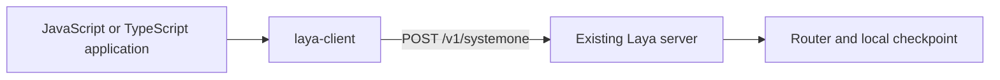

# TypeScript SDK design

`laya-client` is a dependency-free HTTP client for a self-hosted `laya-serve`
server. It uses the `POST /v1/systemone` endpoint and adds no Python production
code or server dependencies.
The npm package starts at version `0.1.0`, independently of Python releases.

## Boundaries

| Component | Responsibility |
| --- | --- |
| `sdk/typescript` | Question/answer types, presets, validation, native fetch, errors and cancellation |
| `laya/serve.py` | Existing HTTP endpoint, Bearer authentication, health and request limits |
| `laya/router.py` | Checkpoint selection, loading and inference routing |
| `laya/agent.py` | Tokenization, PyTorch inference and calibrated answer formatting |
| `laya/presets.py` | Source for the five generated TypeScript question presets |

The SDK exports `predict` and a Laya-only `health` probe. It ships ESM,
CommonJS and declarations, retaining inferred question IDs and choice labels.
Use `laya-client` when a JavaScript or TypeScript application talks over HTTP to
self-hosted Python `laya-serve`. Use `laya-ts` when inference must run directly
inside JavaScript through its local ONNX runtime, without a Python server.

## Shared contract

Requests contain `state` and `questions`. Unless configured or supplied for a
prediction, `laya-client` omits `model`, letting `laya-serve` select a local
checkpoint automatically. A client-wide or per-call `model` can select a local
checkpoint, as can the other per-request controls in the table below. Choice label
arrays are normalized to maps with null descriptions before transport.

Responses preserve `model`, `answers`, and token `usage`. Laya's `routing` and
answer `action` fields are optional extensions; Noul confidence is optional too.
Choice and Score confidence, distributions, and Score legends remain required.
Every answer carries `answer_confidence`, the `max(p)` mass on the reported answer,
which is the same quantity on all three question types. A call that passed
`min_confidence` reports `abstention` and `abstention_threshold` on each of its
answers and `low_confidence: true` on the ones below the threshold; with no
threshold set, none of those three keys are sent, and that absence is the report.
Optional extensions are validated when present.

`/v1/systemone` is the only endpoint the client calls, and it has no standalone routing method:
`laya-client` exposes `predict` and `health` and nothing else, and the live integration test asserts the
server answers `404` for `/v1/route`. The controls the endpoint does honour are per-request, and each is
sent only when the caller supplied the option -- an absent option leaves the deployment's own
`Router(...)` settings in charge instead of overriding them with a client-side default:

| option | request field |
| --- | --- |
| `model` | `model` |
| `task` | `task` |
| `lang` | `lang` |
| `langGuess` | `lang_guess` |
| `maxLen` | `max_len` |
| `headMaxLen` | `head_max_len` |
| `minConfidence` | `min_confidence` |

An option that cannot mean anything is refused locally, before the request goes out: a blank `task`, a
budget that is not a positive integer, a threshold outside `[0, 1]`, or a threshold map that is empty
or holds a value outside `[0, 1]`. Nothing is silently ignored. Laya's
public `/health` returns `status`, `loaded`, `revisions`, `device`, `device_is_preference`,
`checkpoint_devices`, and `cpu_fallbacks` -- the same seven keys the laya-serve deployment
page documents; see [HTTP API](http-api.md). Prediction never probes health first.

FastAPI detail strings and validation arrays are preserved as `LayaAPIError`
messages/details. Structured error envelopes from compatible backends are also
accepted. Requests have configurable deadlines and caller cancellation, and
are never retried automatically.

## Verification and release

Unit tests cover request construction, all answer shapes, Laya extensions,
FastAPI errors, JSON validation, deadlines and cancellation, and hold this
page's control table to the fields the client actually puts on the wire.
Type checks cover optional metadata, inferred
answer types, and ESM/CommonJS consumers. The live integration test starts the
unchanged `laya.serve` application with a tiny offline checkpoint, compares SDK
predictions against direct Python inference, and exercises routing, presets,
authentication and request limits. CI runs the SDK checks on Node.js 22 and 24.

Tiny random weights verify transport and numerical parity, not pretrained
quality or performance.

See the [SDK guide](https://github.com/NandhaKishorM/laya/blob/main/sdk/typescript/README.md)
for setup, examples, and npm publishing. The package will be published under the `laya-client`
name. Python release workflows are unchanged.
