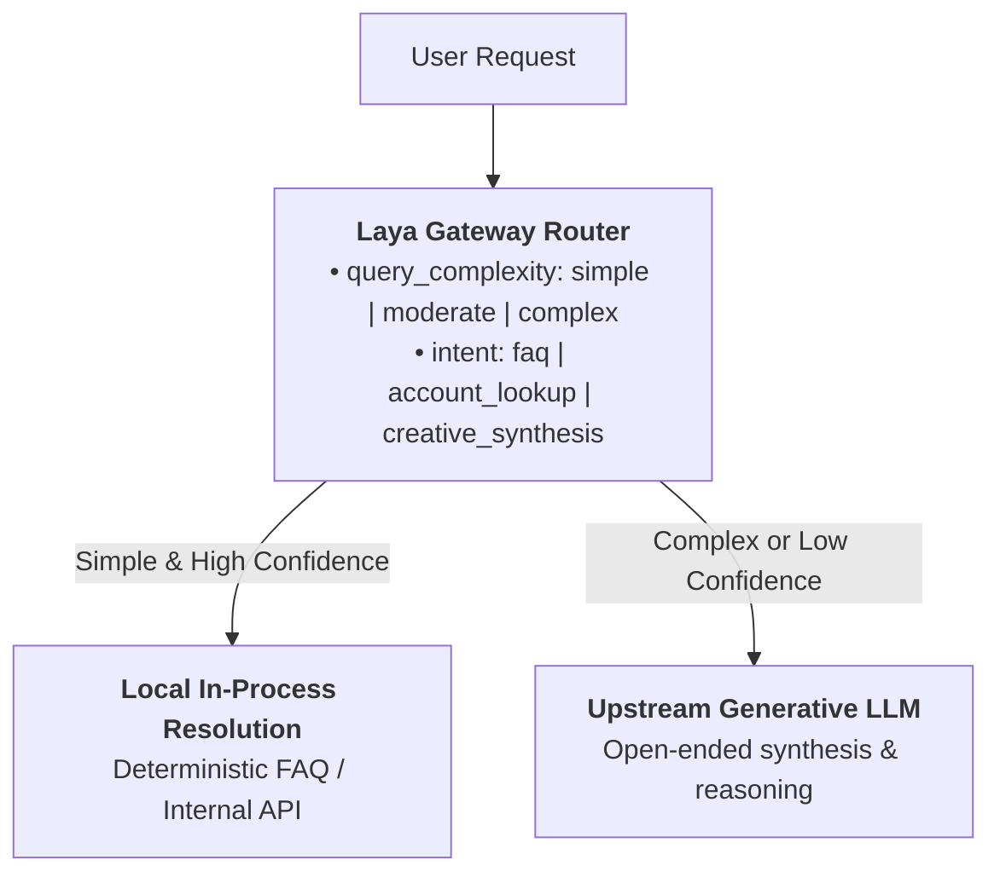
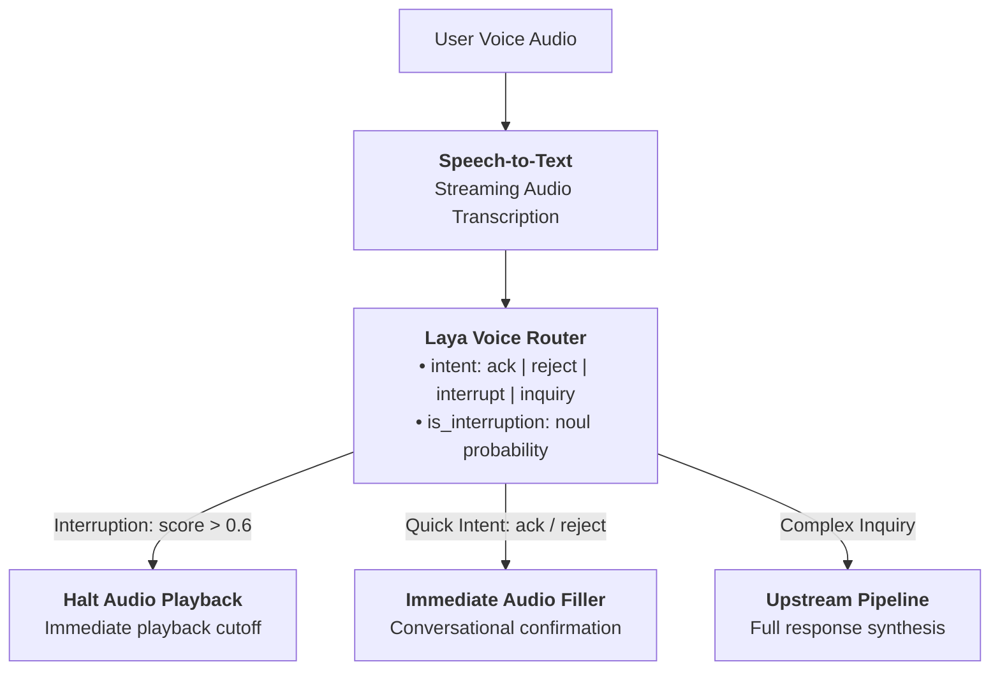
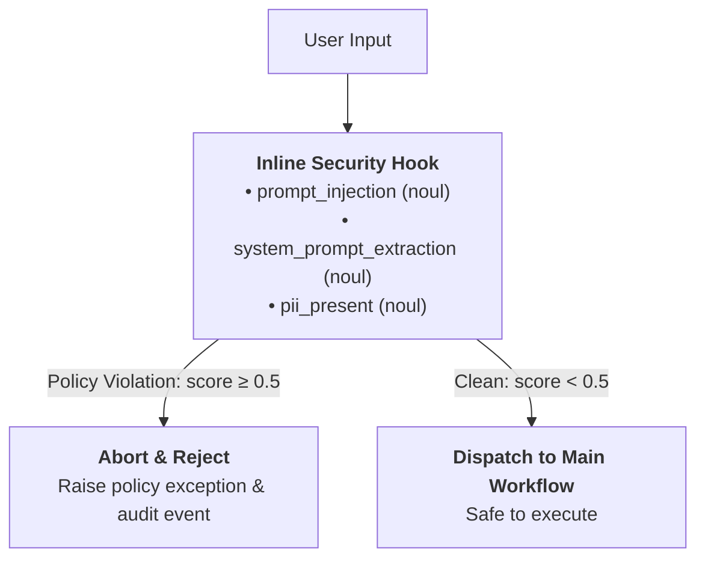
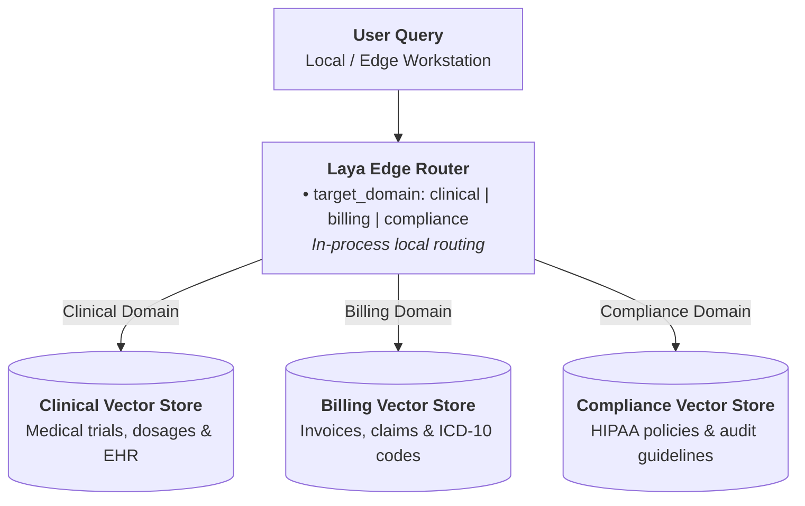
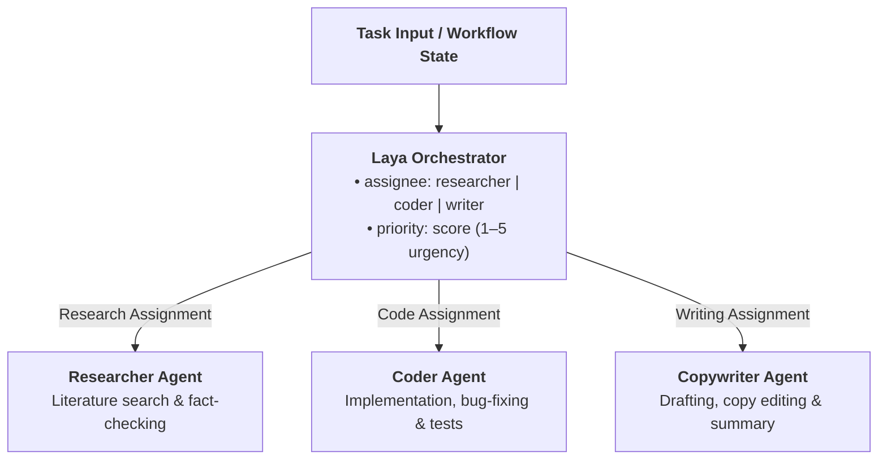
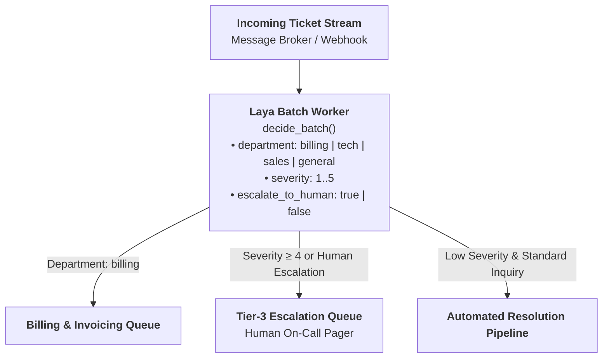

# Architectural Patterns and Production Use Cases

Laya is an on-device, non-autoregressive decision engine built on a single-forward-pass transformer
architecture (`ModernBERT-large` and `mmBERT-base`). Instead of generating tokens sequentially like an
LLM (which incurs variable token generation costs, decode loop overhead, and unpredictable output schemas),
Laya computes calibrated probability distributions across discrete questions in one pass.

This document serves as an architectural blueprint for system architects and backend engineers
integrating Laya into production environments.

---

## Decision Engine vs. LLM vs. Embedding Retrieval

Choosing the right primitive depends on latency constraints, hosting topology, and whether the task
requires free-form generation or discrete classification:

| Dimension | Embedding Retrieval | Laya Decision Engine | Autoregressive LLM |
|---|---|---|---|
| **Computation Model** | Vector cosine distance | Single forward pass (non-autoregressive masked head) | Sequential token-by-token generation |
| **Execution Profile** | Nearest-neighbor index lookup | Single fixed forward pass (no decoding loop) | Iterative decoding loop scaling with output length |
| **Hosting & Topology** | In-process or vector database | In-process (local CPU/GPU) or self-hosted HTTP daemon | Remote hosted API or large-model GPU serving |
| **Context Attention** | Pooled vector representation | Deep bidirectional cross-attention across full input | Causal sequential attention |
| **Structured Output** | Unstructured retrieved chunks | Native schema-aligned distributions (`choice`, `score`, `noul`) | Free-form text requiring JSON repair or schema sampling |
| **Primary Workload** | Broad candidate retrieval | Discrete classification, policy gating & routing | Open-ended synthesis, translation & generation |

---

## 1. Smart Ingress Gateway

In tiered architectures, a large fraction of incoming requests do not require the generative capabilities
of an autoregressive LLM. Queries such as standard FAQs, deterministic state inquiries, or categorical
routing decisions can be evaluated locally.

Laya functions as an intelligent ingress gateway: it classifies query intent and complexity in a single
local forward pass. Deterministic requests are resolved locally via internal endpoints or cached responses,
while complex generative tasks are forwarded to upstream LLMs.

### Architecture



### Implementation

```python
import laya

agent = laya.load("convaiinnovations/laya")

GATEWAY_QUESTIONS = {
    "complexity": {
        "type": "choice",
        "instructions": "How complex is the user's request?",
        "criteria": {
            "canned": "A greeting, standard FAQ, or simple status request.",
            "structured": "A deterministic data query that can be answered by an API.",
            "complex": "Requires creative generation, multi-step code, or complex analysis.",
        },
    },
    "requires_reasoning": {
        "type": "noul",
        "instructions": "Does this query require frontier model reasoning?",
    },
}

def route_request(user_prompt: str):
    res = agent.system_one(user_prompt, GATEWAY_QUESTIONS, min_confidence=0.85)
    answers = res["answers"]

    complexity = answers["complexity"]["choice"]
    low_confidence = answers["complexity"].get("low_confidence", False)

    # Abstain or escalate if complex or unconfident
    if low_confidence or complexity == "complex" or answers["requires_reasoning"]["noul"] > 0.5:
        return call_frontier_llm(user_prompt)

    if complexity == "canned":
        return lookup_faq_response(user_prompt)
    return execute_internal_api(user_prompt)
```

---

## 2. Low-Latency Voice Turn-Taking & Interruption Router

Conversational voice agents (WebRTC, telephony) operate under strict turn-taking constraints: delays in
detecting when a user speaks or interrupts create unnatural conversational dead air. Waiting for a full
generative model to produce its first token introduces avoidable lag when the caller simply acknowledges or
interrupts.

Laya can be placed directly after Speech-to-Text (STT) transcription to classify conversational flow and
user intent in a single forward pass: triggering quick filler audio or halting audio playback immediately
when an interruption is detected, while delegating complex inquiries to the full synthesis pipeline.

### Architecture



### Implementation

```python
from laya import Agent

agent = Agent("convaiinnovations/laya")

VOICE_QUESTIONS = {
    "intent": {
        "type": "choice",
        "instructions": "Caller conversational intention",
        "criteria": {
            "ack": "Caller said yes, ok, sure, or agreed.",
            "reject": "Caller said no, cancel, or disagreed.",
            "interrupt": "Caller said hold on, wait, or wants to stop.",
            "inquiry": "Caller is asking a detailed question.",
        },
    },
    "is_interruption": {
        "type": "noul",
        "instructions": "Is the caller interrupting the current speech playback?",
    },
}

def on_voice_chunk(transcript: str, is_speaking: bool):
    decision = agent.system_one(transcript, VOICE_QUESTIONS)
    answers = decision["answers"]

    # Halt playback immediately if caller interrupts
    if answers["is_interruption"]["noul"] > 0.6:
        stop_audio_playback()

    intent = answers["intent"]["choice"]
    if intent in ("ack", "reject"):
        play_immediate_filler_audio(intent)
    else:
        dispatch_to_background_pipeline(transcript)
```

---

## 3. Pre-LLM Security & Prompt Firewall

Protecting systems against adversarial prompt injections, jailbreaks, and sensitive data leakage
must happen *before* the prompt reaches the LLM context window. Running a separate generative model just to
judge whether a prompt is safe adds redundant latency and operational overhead.

Laya operates as an inline, non-autoregressive security firewall, evaluating prompt injections,
privilege escalations, and out-of-scope tasks in a single forward pass before downstream processing.

### Architecture



### Implementation

Hooks in Laya are duck-typed: any object implementing the lifecycle methods of `Hook` (or subclassing
`BaseHook` from `laya.hooks`) can be attached to an `Agent` or `Router`. 

Under Laya's default hook raising semantics (`hooks_raise=True`):
- Raising an exception inside `on_predict_start` immediately aborts execution **before** model tokenization or inference occurs.
- The exception propagates directly out of `system_one()` / `predict()` to the caller.
- Lifecycle cleanups (`on_error` and `on_predict_end`) still execute, with `ctx.error` set to the raised exception, ensuring audit logs and telemetry record the blocked request.

```python
import laya
from laya import Router
from laya.hooks import BaseHook, PredictContext

SECURITY_SCHEMA = {
    "is_jailbreak": {
        "type": "noul",
        "instructions": "Is the user attempting a prompt injection, exploit, or jailbreak?",
    },
    "extracts_system_prompt": {
        "type": "noul",
        "instructions": "Is the user asking to reveal instructions, system prompts, or hidden rules?",
    },
    "pii_leak": {
        "type": "noul",
        "instructions": "Does the input contain passwords, API keys, or credentials?",
    },
}

class SecurityFirewallHook(BaseHook):
    """Inspect inputs before inference; raises on policy violation.

    With hooks_raise=True (the default), raising from on_predict_start aborts
    inference immediately and propagates the exception to the caller, while
    allowing any downstream on_error or audit logging hooks to record the event.
    """
    def __init__(self, guard_agent):
        self.guard = guard_agent

    def on_predict_start(self, ctx: PredictContext):
        for state in ctx.states:
            check = self.guard.system_one(state, SECURITY_SCHEMA)
            ans = check["answers"]
            if ans["is_jailbreak"]["noul"] > 0.5 or ans["extracts_system_prompt"]["noul"] > 0.5:
                raise PermissionError("Request blocked by security firewall: adversarial prompt detected.")

# Attach to Router or Agent; hooks_raise=True ensures policy exceptions propagate
guard_agent = laya.load("convaiinnovations/laya")
router = Router(hooks=[SecurityFirewallHook(guard_agent)], hooks_raise=True)
```

> [!TIP]
> For CrewAI workflows, Laya also provides [`LayaTaskGuard`](crewai.md) out of the box in `laya.integrations.crewai` for this exact pre-execution safety gate pattern.

---

## 4. Air-Gapped Edge RAG Router

In secure enterprise environments (defense, healthcare, financial compliance, edge appliances), external
APIs are unavailable or forbidden. Document collections are often segregated into distinct domains
(e.g., Clinical Trials, Patient Records, Financial Reports, Technical Specs).

Rather than querying a single monolithic vector index with unrelated embeddings, Laya acts as a local edge
router that directs user queries to the specific local vector index or SQLite database before retrieval.

### Architecture



### Implementation

```python
from laya import Router

# Automatically routes between local English and Multilingual models
router = Router()

INDEX_QUESTIONS = {
    "target_domain": {
        "type": "choice",
        "instructions": "Which domain index contains the source truth for this query?",
        "criteria": {
            "clinical": "Medical conditions, medications, dosages, and clinical trials.",
            "billing": "Invoices, payment claims, ICD-10 billing codes, and insurance.",
            "compliance": "HIPAA compliance rules, privacy policies, and data audits.",
        },
    }
}

def query_airgapped_rag(user_query: str):
    decision = router.predict(user_query, INDEX_QUESTIONS)
    domain = decision["answers"]["target_domain"]["choice"]
    
    # Load and search only the relevant isolated local index
    local_index = get_isolated_vector_store(domain)
    return local_index.similarity_search(user_query, k=4)
```

---

## 5. Hierarchical Multi-Agent Task Delegation

Multi-agent frameworks often employ an LLM "manager" or "supervisor" node to decide which specialized agent
should execute the next step.

Because generative manager nodes generate tokens sequentially, supervisor delegation can introduce
substantial orchestration overhead per hop. Replacing the generative supervisor with a non-autoregressive
decision model performs delegation in a single forward pass, providing deterministic routing across agents.

Laya ships first-party integrations for popular orchestration frameworks:
- **CrewAI:** Use [`LayaCrewRouter`](crewai.md) for hierarchical multi-agent task routing and guardrails.
- **LlamaIndex:** Use [`LayaSingleSelector`](llamaindex.md) for single-forward-pass router query engines.
- **LangChain / LangGraph:** Use [`laya.integrations.langchain`](langchain.md) for conditional edge dispatch.

### Architecture



### Implementation (CrewAI / LangGraph Example)

```python
from laya import Router

router = Router()

DELEGATION_QUESTIONS = {
    "assignee": {
        "type": "choice",
        "instructions": "Assign this task to the most qualified specialist.",
        "criteria": {
            "researcher": "Needs literature search, fact checking, or data collection.",
            "coder": "Needs bug fixing, script writing, or unit test generation.",
            "writer": "Needs article drafting, copy editing, or summary composition.",
        },
    },
    "priority": {
        "type": "score",
        "instructions": "Urgency score from 1 (low) to 5 (critical)",
        "criteria": ["1", "2", "3", "4", "5"],
    },
}

def supervisor_node(state):
    task_description = state["task"]
    decision = router.predict(task_description, DELEGATION_QUESTIONS)
    answers = decision["answers"]

    return {
        "next_agent": answers["assignee"]["choice"],
        "urgency": answers["priority"]["score"],
    }
```

---

## 6. High-Throughput Ticket & Support Triage

Customer support organizations and operations centers process large volumes of tickets, emails, and alerts daily.
Using hosted generative LLM APIs for categorical triage can introduce:
1. **Network rate limits:** Throttling during sudden volume spikes.
2. **Cost amplification:** Incurring variable token costs solely for discrete classification.
3. **Schema drift:** Generative models returning malformed JSON or markdown codeblocks.

Batch processing pipelines can evaluate ticket streams on shared forward passes using `predict_batch` or
`decide_batch()`, outputting strict typed data directly conforming to application schemas.

### Architecture



### Implementation

```python
from laya.structured import decide_batch
from laya import Agent

agent = Agent("convaiinnovations/laya")

# Strict typed schema
TICKET_SCHEMA = {
    "type": "object",
    "properties": {
        "department": {
            "type": "string",
            "enum": ["billing", "technical_support", "sales", "general"],
            "description": "Primary support category",
        },
        "severity": {
            "type": "integer",
            "minimum": 1,
            "maximum": 5,
            "description": "Severity level from 1 (minor) to 5 (outage)",
        },
        "escalate_to_human": {
            "type": "boolean",
            "description": "True if customer is angry, threatening churn, or reporting a legal issue",
        },
    },
}

def process_ticket_batch(tickets: list[str]):
    # Returns typed dictionaries conforming exactly to TICKET_SCHEMA
    results = decide_batch(agent, tickets, TICKET_SCHEMA)
    for ticket_text, structured in zip(tickets, results):
        enqueue_ticket(
            department=structured["department"],
            severity=structured["severity"],
            human_required=structured["escalate_to_human"],
            raw_text=ticket_text,
        )
```

---

## Production Deployment Checklist

Before rolling out any of the above patterns to production, verify:

1. **Hardware sizing:** Ensure sufficient host memory for resident model weights. On CPU, configure thread pools
   appropriately (`torch.set_num_threads`).
2. **Confidence thresholding:** Set `min_confidence` (e.g. `0.80–0.90`) on mission-critical gates so
   the system safely falls back when queries are ambiguous.
3. **Multilingual routing:** Use `Router()` instead of a static `Agent()` when user traffic includes
   mixed or non-English inputs.
4. **Staged rollout:** Follow the [Staged Adoption Guide](staged-adoption.md) to shadow production traffic
   before making decisions authoritative.
